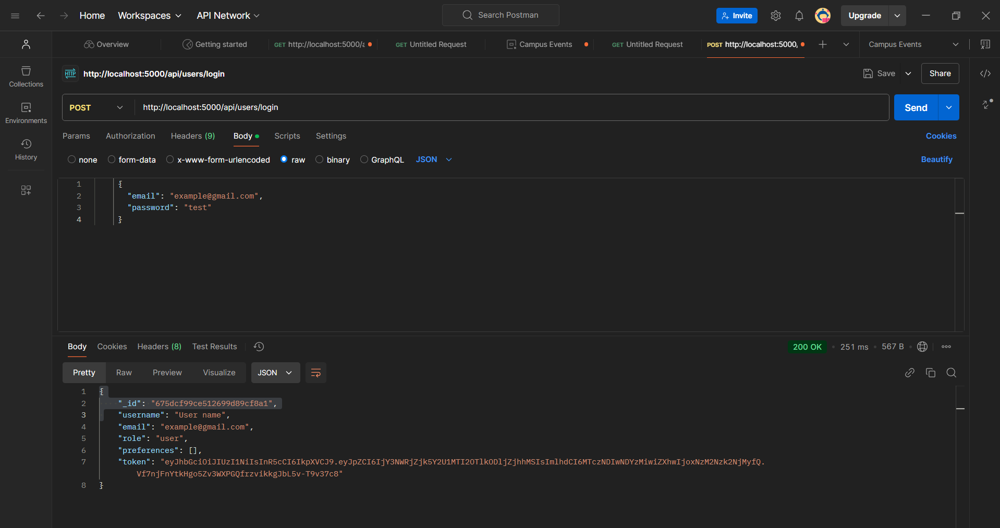
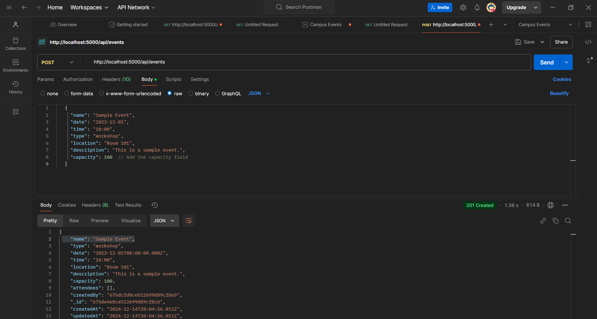

# Campus Events Management System

## Project Overview
This is a web app called the Campus Events Management System. It allows users to view and manage campus events. Users can filter events by type and see them in a calendar view.

## Deployment Link
Live version: [Campus Events Management System](https://event4camp.vercel.app/)

## Login Details
Test accounts:
- **User Account:**
  - Email: example@gmail.com
  - Password: test
- **Admin Account:**
  - Email: example1@gmail.com
  - Password: test

## Feature Checklist
- [x] User Login
- [x] View Upcoming Events
- [x] Create Events (Admin Only)

## Installation Instructions

### Step 1: Fork the Repositories
1. Go to the [Frontend Repository](https://github.com/Latifpro108108/campusManagerFrontend.git).
2. Click on the "Fork" button in the top right corner to create a copy of the repository in your GitHub account.
3. Repeat the same process for the [Backend Repository](https://github.com/Latifpro108108/campusmanagerBackend.git).

### Step 2: Clone the Repositories
To get the project on your local machine, you need to clone both the frontend and backend repositories.

1. **Clone the Frontend Repository:**
   ```bash
   git clone https://github.com/yourusername/campusManagerFrontend.git
   ```

2. **Clone the Backend Repository:**
   ```bash
   git clone https://github.com/yourusername/campusmanagerBackend.git
   ```

### Step 3: Set Up the Frontend

1. Navigate to the frontend directory:
   ```bash
   cd campusManagerFrontend
   ```

2. Install the dependencies:
   ```bash
   npm install
   ```

3. Start the frontend server:
   ```bash
   npm start
   ```

4. Open your browser and go to `http://localhost:5174` to view the frontend.

### Step 4: Set Up the Backend

1. Open a new terminal window and navigate to the backend directory:
   ```bash
   cd campusmanagerBackend
   ```

2. Install the dependencies:
   ```bash
   npm install
   ```

3. Create a `.env` file in the root of the backend directory and add your environment variables (e.g., database connection string). Here’s an example of what you might include:
   ```
   DATABASE_URL=mongodb://localhost:27017/yourdbname
   PORT=5000
   ```

4. Start the backend server:
   ```bash
   npm start
   ```

5. The backend will typically run on `http://localhost:5000` (or the port specified in your configuration).

## API Documentation

### User Routes
1. **User Login**
   - **Method:** POST
   - **URL:** `http://localhost:5000/api/users/login`
   - **Body (JSON):**
     ```json
     {
       "email": "example@gmail.com",
       "password": "test"
     }
     ```

### Event Routes
1. **Get All Events**
   - **Method:** GET
   - **URL:** `http://localhost:5000/api/events`

2. **Create Event (Admin Only)**
   - **Method:** POST
   - **URL:** `http://localhost:5000/api/events`
   - **Body (JSON):**
     ```json
     {
       "name": "Sample Event",
       "date": "2023-12-01",
       "time": "10:00",
       "type": "workshop",
       "location": "Room 101",
       "description": "This is a sample event.",
       "capacity": 100
     }
     ```
   - **Headers:**
     - `Authorization: Bearer <admin_token>`

## Screenshots of API Tests
Here are screenshots of the tests performed in Postman:

- **User Login:**
     

- **View Events:**
     

- **Create Event:**
     

## How to Create an Event

1. **Create a New Request:**
   - Set the method to **POST**.
   - Enter the URL:
     ```
     http://localhost:5000/api/events
     ```

2. **Go to the Body Tab:**
   - Select **raw** and choose **JSON** from the dropdown.

3. **Enter the JSON Data:**
   - Paste the following JSON body:
   ```json
   {
     "name": "Sample Event",
     "date": "2023-12-01",
     "time": "10:00",
     "type": "workshop",
     "location": "Room 101",
     "description": "This is a sample event.",
     "capacity": 100
   }
   ```

4. **Go to the Headers Tab:**
   - Add:
     - **Key:** `Authorization`
     - **Value:** `Bearer <admin_token>` (replace `<admin_token>` with the actual token)

5. **Click "Send":**
   - After setting everything up, click the **"Send"** button.

6. **Check the Response:**
   - You should receive a response indicating that the event was created successfully.
